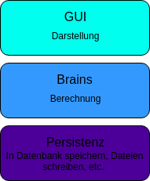

# Clean Code

## Mitschriften von Clean Code Tutorial von The Morpheus Tutorials

[Link zur Playlist](https://www.youtube.com/playlist?list=PLNmsVeXQZj7ryyZikMDPxxyYxEKtKn0ji)

### 1. Einführung
Sind  Richtlinien für das saubere Programmieren.

#### Warum?
- Leserlich
- Strukturiert
- Kurze Einarbeitungszeit
- Bessere Lesbarkeit für fremde Personen
- Bessere Wartbarkeit

#### Uncle Bob formatting
Die Reihenfolge der Attribute und Methoden sind wichtig.
Es sollte versucht werden, Public Attribute zu vermeiden. Dafür sollten getter und setter Methoden angelegt werden.

Ideale Reihenfolge:
```java
class Konto {
	public String inhaber:

	private int guthaben;

	public Konto(){...}

	public static ...

	private static ...

	public ueberweisung(...){...}

	public getGuthaben(...){...}
	public setGuthaben(...){...}
}
```

### 2. Law of Demeter

"Don't talk to Strangers" also, nicht so etwas:

~~int i = getObj().getObj2().getObjA().getSomeOtherObject().getArray()[0];~~

Darum mit ``this`` auf Objekte der Instanz zugreifen.

### 3. Prinzip der kleinsten Überraschung

#### Vorhersehbarkeit von Programmablauf
Das was in den Methodenname steht, sollte auch ausgeführt werden. Und nicht noch x-beliebige andere Aufgaben erfüllen.

Negativbeispiel:

```java
class A {
	private File SomeUnimportantFile;

	File getUnimportantFile(){
		launchNuklearMissile();
		return SomeUnimportantFile;
	}

	launchNuklearMissile(){
		//Destroy Everything!
	}
}
```

#### Logische Aufbau
Also bei Aufzählungen sollte die Reihenfolge beachtet werden. Bei Wochentagen  z.B.: Montag, Dienstag ... etc.
Auch Teile die nicht erwartet werden, sollten raus gelassen werden, bei einer Aufzählung von Wochentagen sollte kein  ```"Frei"``` dabei sein.
Auch wenn ```"Frei"``` der Tag ist wo nicht gearbeitet wird.

Negativbeispiel:

```java 
enum Date {
	FREITAG, DIENSTAG, MITTWOCH, FREI
}
```

#### Namen benennen
Um das Beispiel von oben nochmal aufzugreifen, haben wir jetzt die unvorhersehbare Ausführung (``launchNuklearMissile();``) entfernt.

```java
class A {
	private File SomeUnimportantFile;

	File getUnimportantFile(){
		return SomeUnimportantFile;
	}

	public launchNuklearMissile(){
		//Destroy Everything!
	}
}
```

Doch jetzt fällt uns auf das ``A`` und ``getUnimportantFile`` nicht gerade sehr aussagekräftig sind, hierfür sollten eindeutigere Bezeichner benutzt werden.

Beispiel:

```java
class Waffenstillstand {
	private File vertrag;

	File getVertrag(){ 
		return vertrag;
	}

	public launchNuklearMissile(){
		//Destroy Everything!
	}
}
```

Weitere interessante Bennnung sind Doppelungen von Namen der Klasse sowie des Attributs und Methoden.

Negativbeispiel:

```java
class Konto {
	int kontoname;

}
```
Hier ist das ``Konto`` zweimal drin.

Besser wäre sowas:

```java
class Konto {
	int name;

}
```
### 4. Kommentare
Zu Wenig ist zu wenig und zuviel ist zuviel.

#### Angebracht
 - Bei schwer verständlichen Programmteilen. 
 - Bei  Verhalten, wenn es zu Beispiel die Laufzeit betrifft.
 - Gedanken, wenn man für diese Lange braucht 
 - Bei Regular Expression, was dieser tut.
 - TODOs kennzeichnen 

#### Unangebracht 
 - Sinnlos z.B. wenn der Name einer Funktion zum Satz formuliert wird 
 - Nicht bei Codeteilen, die als eigene Funktion ausgelagert werden müssten

### 5. DRY: Dont repeat yourself
Viele Fehler entstehen durch "Kopieren" und "Einfügen".
Ersetzen und durch Prozeduren/Funktionen.

### 6. YAGNI: You aint gonna need it 
Du wirst es nicht brauchen.

Negativbeispiel:
```java
class Konto {
	public bool ueberweisung(String empfaenger){...}
	public bool indieSchweizueberweisung(String empfaenger){...}
}
```
Die Methode ``indieSchweizueberweisung``kann bei dem ersten Erscheinen eines Programmes für eine Bank überflüssig sein.

### 7. SOLID Single Responsibility

Eine Verantwortlichkeit pro Klasse.

```java
class myConnector {
	void connect(){...}
	void terminateConnection(){...}
}
```
Eine ``send()`` sowie eine ``receive()`` Methode müssten in eine Seperate Classe ausgelagert werden.

```java
class Communicator{
	void send();
	void receive();
}
```
Grob kann man sagen, eine Klasse nicht mehr als so ca. 200 Zeilen beinhalten sollte, oder um die 15 Methoden.

### 8. SOLID Open Closed Prinzip
Open for extension closed for modification
Es kann erweitert werden, aber es muss dazu nicht verändert werden.

Negativbeispiel:
```java
class Form{...}

for Form f in FormListe{
	switch(typeof(f)){
		case Kreis: f.zeichneKreis();
		case Quadrat: f.zeichneQuadrat();
	}
}
```
Die ``switch case `` Verzweigung muss jedes Mal neu angepasst werden,
wenn diese Art der Implementierung in der Code Bases öfter auftritt, muss das an jeder Stelle noch mal geändert werden. Darum sollte die  Klasse ``Form `` eine Methode ``draw()`` zur Verfügung stellen 

```java
class Form{
	zeichne();
}

for Form f in FormList:
	f.draw();
```

Die Unterklasse z.B. ``Kreis`` werden dann dazu gezwungen eine Implementierung von ``draw()`` zu übernehmen.

### 9. SOLID  Liskovsches Substitutionsprinzip

Vererbung, die nicht funktioniert:
```java 
class Rechteck{
	float breit;
	float hoch;
}

class Quadrat extends Rechteck{
	// hoch === breit
}
```
Jedes Quadrat ist ein Rechteck, funktioniert in der  Mathematik aber nicht im programmiertechnischen Sinn.
Die Klasse ``Quadrat `` kann nicht von ``Rechteck`` erben, weil die Höhe immer gleich der Breite ist.

Andersherum geht das:
```java 
class Quadrat{
	float breit;
	
	flaeche(){
		return breit * breit
	}
}

class Rechteck extends Quadrat{
	float hoch;
	
	fläche(){
		return hoch * breit
	}

}
```
In diesem Beispiel muss die Methode ``flaeche()`` noch Überschrieben werden.

### 10. SOLID Interface Segregation
Wenn von einem Interface geerbt wird, muss es auch gebraucht werden.

Negativ Beispiel:
```java
interface Worker{
	eat();
	work();
}

class Mensch implements Worker{
	work(){...}
	eat(){...}
}

class Robot implements Worker{
	work(){...}
	eat(){} //<- Zuviel
}
```
Die Methode ``eat()`` wird an die Klasse Robot mitgegeben, dies muss dann überschrieben werden und Leer gelassen bleiben (Toter Code).
Besser wären in diesem Fall zwei Interfaces ``Eats`` und ``Work``.

```java 
interface Eats{
	eat();
}

interface Worker {
	work();
}

class Mensch implements Eats, Worker{
	work(){...}
	eat(){...}
}

class Robot implements Worker{
	work(){...}
}
```

### 11. SOLID Dependency Inversion

In Software haben wir mehrere Schichten:



Eine ``CopyPast`` Interface braucht z.B. zwei weitere Klassen namens ``ReadUserInput`` und ``WriteFile``.
Das ``CopyPast`` ist aus einer sehr hohen Schicht (fast in der GUI Schicht). Die Klassen ``ReadUserInput`` und ``WriteFile`` sind in einer niedrigeren Schicht (``WriteFile`` ist in der Persistenz Schicht).``CopyPast`` hängt in diesem Fall von den beiden Klassen ab, jedoch möchte man das Umgekehrte erreichen. Um das zu bewerkstelligen wird nun eine Classe erstellt, die sich in einer höhren Schicht befindet. In unserem Beispiel ``Reader`` Klasse für ``ReadTextInput`` und eine ``Writer`` Classe für ``WriteFile``.

### 12. SLA: Single Level of Abstraction

Methode hat eine Abstractionsebene in der geblieben werden soll. Diese Abstractionsebene sollten von Methode zu Methode abnehmen. Von der Abstrakteste Methode ruft nur Methoden auf, die von aussen für niemanden sichtbar sind. In diesen unteren Methoden verbergen dann die eigentlichen Rechenoperationen.

### 13. Refactoring und Pfadfinderregel

#### Pfadfinderregel
Man möchte den Code immer sauberer verlassen als man ihn Vorgefunden hat.

#### Refactoring

##### Methoden Verändern
Nach Aussen sollen sich Methoden nicht ändern.
Was tun, wenn ein Parameter gebraucht wird, den es vorher nicht gab, einfache Lösung einsetzten default Parameter.

 - Lange Methoden -> Verwenden von Abstraktionsebenen
 - Doppelten Code -> Auslagern in Methoden
 - Feature Envy ~~getA().getB().attr~~ -> Methode extrahieren 
 - Data Klasse (Haben nur Daten ohne Funktionen) -> aufteilen in Classen, die dann auch Methoden brauchen.
 - Gott Klasse (Vielzuviel aufeinmal) -> auslagern in verschiedene Klassen

##### Testfälle
Nur mit Test Fallen bearbeiten, sonst besteht die Gefahr den Code zu zerstören, ohne es mitzubekommen.

Immer wenn du dein eigenen Code nicht mehr verstehst, solltest du ihn überarbeiten.

Ordentlichkeit vor Performenz erst aufräumen, dann schnell machen.